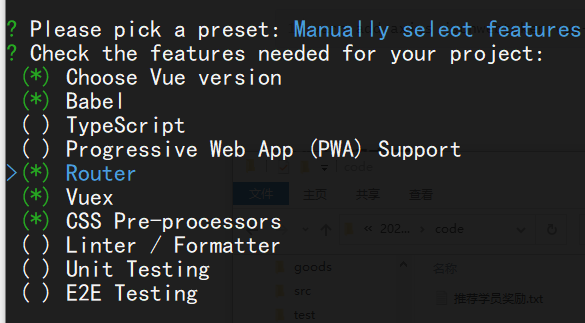

## 前期配置

### 项目预览

*http://1.116.64.64:5004/*

### 构建项目

```shell
vue create finance-manager; cd finance-manager; yarn serve
```

 ****


### 安装第三方依赖

```shell
npm i axios jsonwebtoken vue-count-to echarts element-ui@2.15.8 -S
```


### JWT的解密码

`jindu520`

### 资产文件


### 复制401和404组件到项目中


### public目录下的menus后台路由


### 保存好接口文档

* 用户名:admin

* 密码:  __approve123456.__ 注意,最后有个__英文的点__


